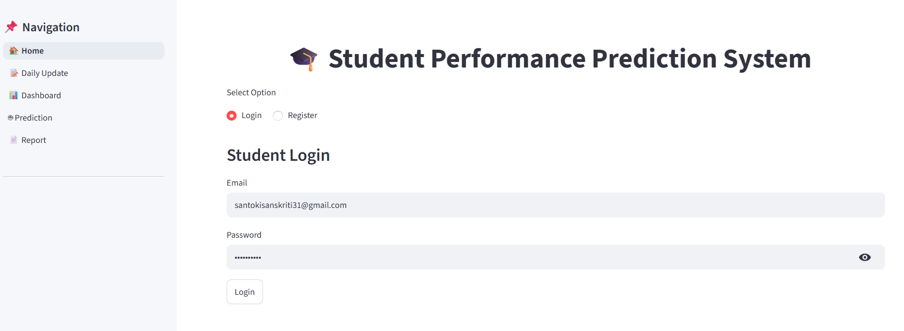
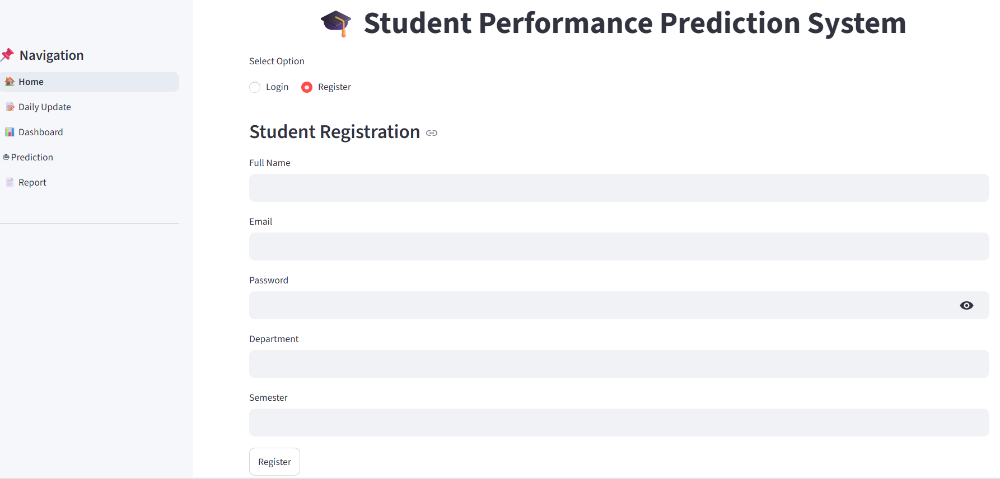

# 🎓 Student Performance Prediction System

An AI-powered web application built using **Python, Streamlit, SQLite, and Machine Learning** that helps students track their academic performance, analyze study habits, and predict future results based on their daily activities.

---

## 📖 Project Overview

The Student Performance Prediction System allows students to record their daily academic activities, monitor their progress through interactive dashboards, and receive AI-based performance predictions. The application also generates detailed PDF reports for performance analysis.

---

## ✨ Features

- 🔐 Student Registration & Login
- 📚 Daily Academic Activity Tracking
- 📅 Attendance Management
- 😴 Sleep & Mood Monitoring
- 📊 Interactive Dashboard & Analytics
- 🤖 AI-Based Performance Prediction
- 📈 Performance Trends & Visualizations
- 📄 Downloadable PDF Performance Reports
- 💾 SQLite Database Integration

---

## 🛠️ Technologies Used

| Technology | Purpose |
|------------|---------|
| Python | Backend Development |
| Streamlit | Web Application Framework |
| SQLite | Database Management |
| Scikit-learn | Machine Learning Model |
| Pandas | Data Processing |
| NumPy | Numerical Computing |
| Matplotlib | Data Visualization |

---

## 📂 Project Structure

```text
Student-Performance-Prediction-System/
│
├── database/
│   └── database.db
│
├── models/
│   ├── student_model.pkl
│   └── train_model.py
│
├── pages/
│   ├── analytics.py
│   ├── daily_update.py
│   ├── dashboard.py
│   ├── prediction.py
│   └── report.py
│
├── screenshots/
│   ├── Login.png
│   ├── Registration.png
│   ├── Daily Update.png
│   ├── Daily Update History.png
│   ├── Dashboard 1.png
│   ├── Dashboard 2.png
│   ├── Dashboard 3.png
│   ├── Prediction 1.png
│   ├── Prediction 2.png
│   ├── Report 1.png
│   └── Report 2.png
│
├── utils/
│   ├── advisor.py
│   ├── auth.py
│   ├── db.py
│   ├── pdf_generator.py
│   ├── predictor.py
│   └── sidebar.py
│
├── app.py
├── requirements.txt
├── README.md
└── .gitignore
```

---

# 📸 Application Screenshots

## 🔐 Login Page



---

## 📝 Registration Page



---

## 📚 Daily Update


---

## 📖 Daily Update History


---

## 📊 Dashboard

### Dashboard Overview


### Performance Insights


### Student Analytics


---

## 🤖 AI Performance Prediction

### Prediction Result


### AI Recommendation


---

## 📄 Report Generation

### Performance Report


### Downloadable PDF Report


---

## 🚀 Installation

### 1️⃣ Clone the Repository

```bash
git clone https://github.com/Sanskriti3116/Student-Performance-Prediction-System.git
```

### 2️⃣ Navigate to the Project

```bash
cd Student-Performance-Prediction-System
```

### 3️⃣ Install Dependencies

```bash
pip install -r requirements.txt
```

### 4️⃣ Run the Application

```bash
streamlit run app.py
```

---

## 🎯 Future Improvements

- 📱 Responsive Mobile Interface
- ☁️ Cloud Database Integration
- 📧 Email Notifications
- 🏆 Student Achievement Badges
- 📅 Calendar-Based Progress Tracking
- 🤖 Enhanced AI Recommendations

---

## 👩‍💻 Author

**Sanskriti Santoki**

🎓 BCA Student

💻 Python Developer

🤖 Machine Learning Enthusiast

GitHub: https://github.com/Sanskriti3116

---

## ⭐ Support

If you found this project helpful, please consider giving it a ⭐ on GitHub.